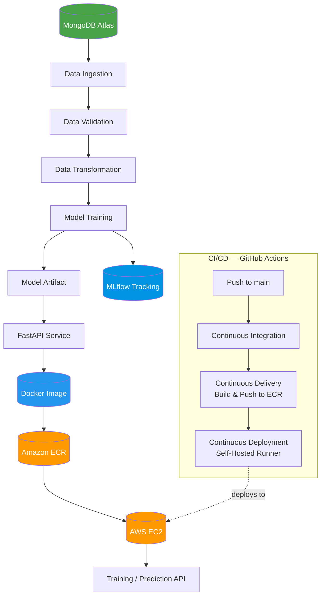
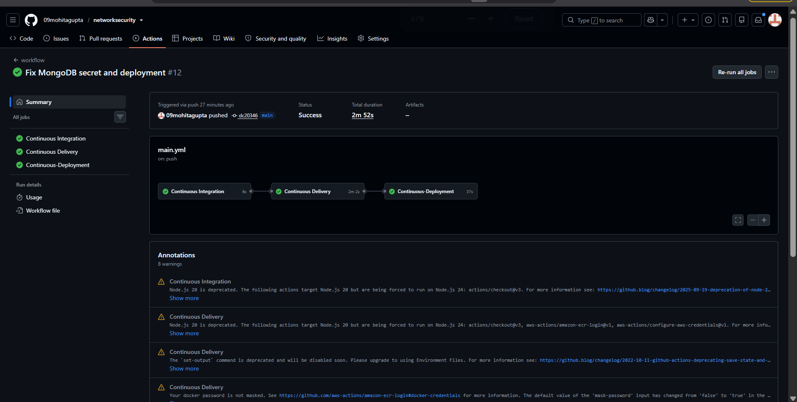
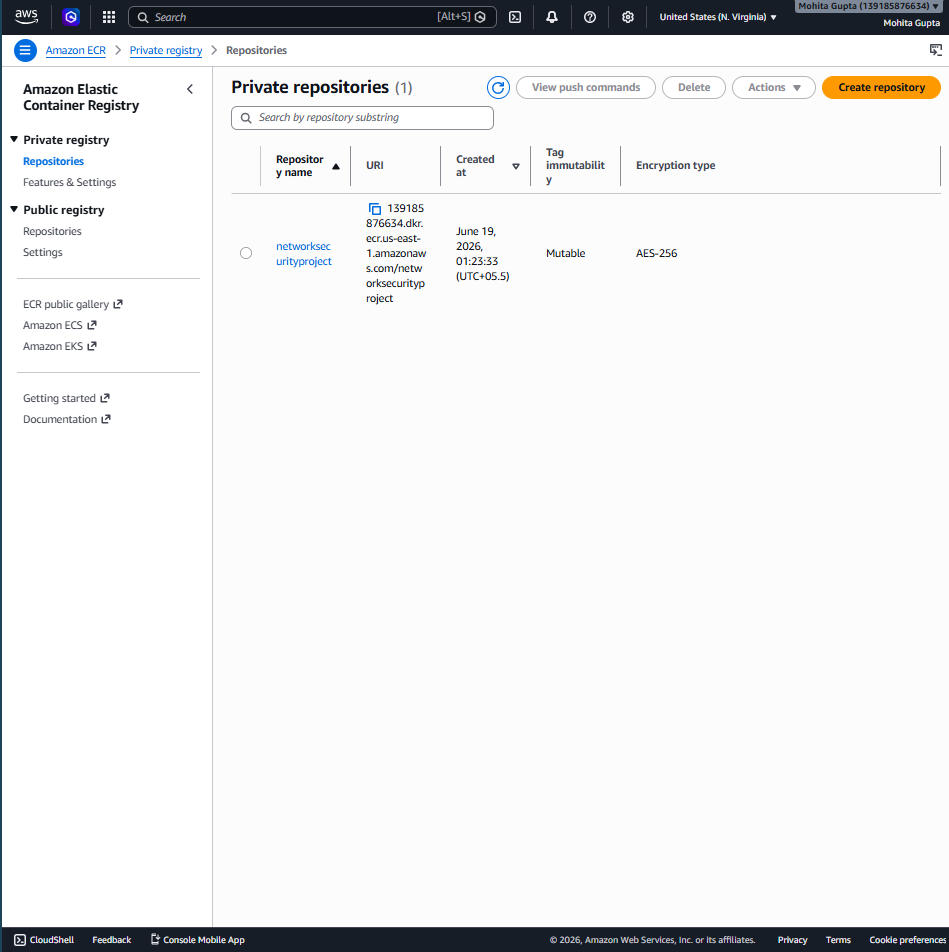
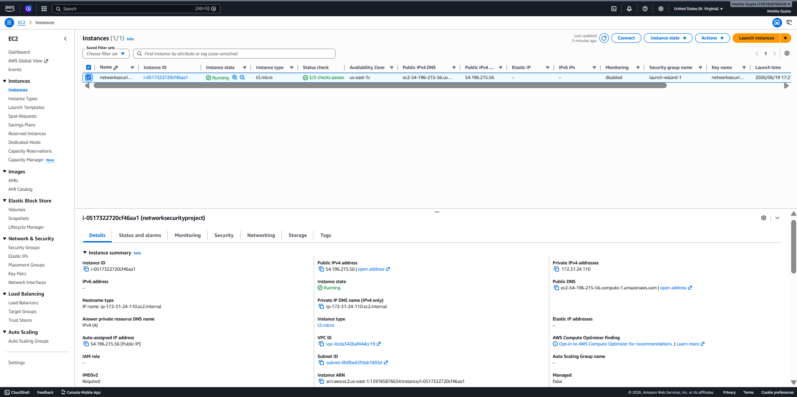
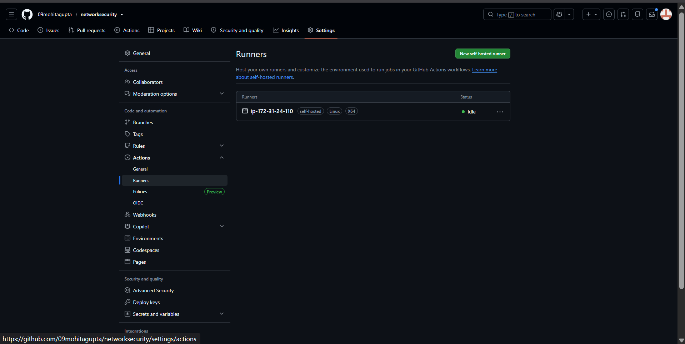
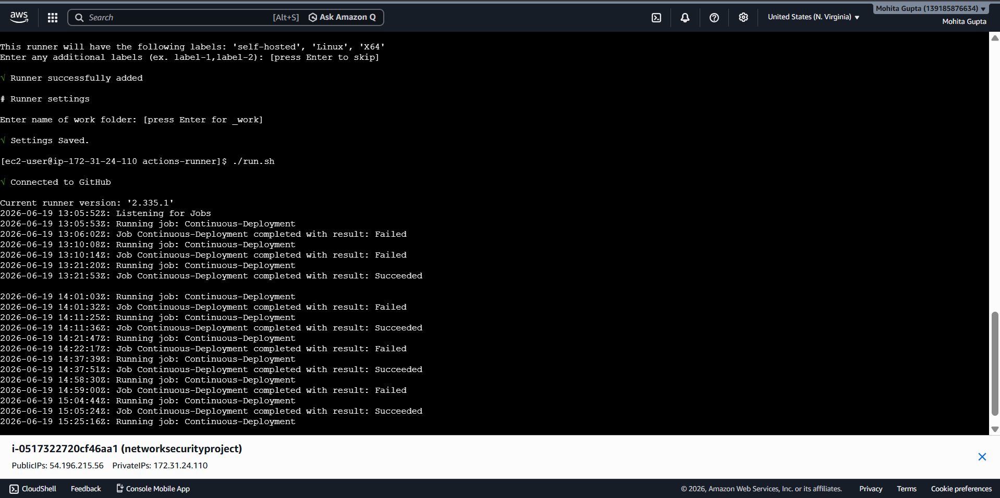
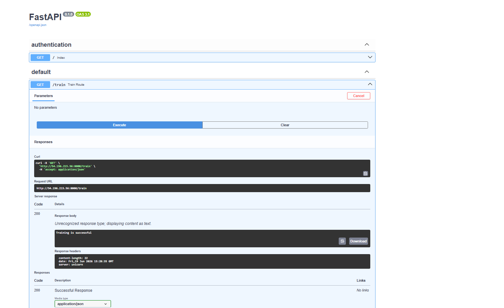
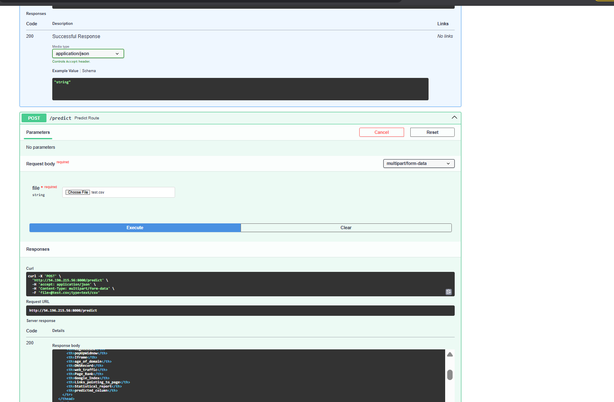
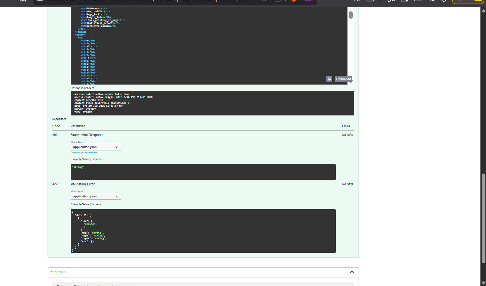

### Netw<div align="center">

# Network Security MLOps Pipeline

**An end-to-end machine learning system for automated network threat detection, built and deployed using production MLOps practices.**

[](https://www.python.org/)
[](https://fastapi.tiangolo.com/)
[](https://www.docker.com/)
[](https://aws.amazon.com/)
[](https://www.mongodb.com/atlas)
[](https://mlflow.org/)
[](https://github.com/features/actions)
[](LICENSE)

</div>

---

## Project Overview

This repository implements a complete MLOps pipeline for detecting malicious network activity through a binary classification model. The system covers the full lifecycle of a production ML application: data ingestion from MongoDB Atlas, automated validation and transformation, model training with experiment tracking in MLflow, and inference served through a FastAPI REST API.

The application is containerized with Docker, with images versioned in Amazon ECR and deployed to an AWS EC2 instance. Deployment is fully automated through a three-stage GitHub Actions pipeline (Continuous Integration, Continuous Delivery, Continuous Deployment) using a self-hosted runner registered directly on the target EC2 instance.

The project is designed to demonstrate practical MLOps engineering — reproducible pipelines, automated infrastructure, and a deployed, callable API — rather than a one-off notebook experiment.

---

## Architecture



---

## Tech Stack

| Category | Technologies |
|---|---|
| Language | Python |
| API Framework | FastAPI |
| Machine Learning | Scikit-Learn, Pandas, NumPy |
| Experiment Tracking | MLflow |
| Database | MongoDB Atlas |
| Containerization | Docker |
| Cloud Infrastructure | AWS EC2, AWS ECR |
| CI/CD | GitHub Actions, Self-Hosted Runner |

---

## Project Workflow

```
MongoDB Atlas
      │
      ▼
Data Ingestion
      │
      ▼
Data Validation
      │
      ▼
Data Transformation
      │
      ▼
Model Training
      │
      ▼
MLflow Logging
      │
      ▼
Model Saving
      │
      ▼
FastAPI Service
      │
      ▼
Docker Image
      │
      ▼
AWS ECR
      │
      ▼
AWS EC2
      │
      ▼
Prediction API
```

---

## Features

- Automated data ingestion from MongoDB Atlas
- Schema-based data validation to detect drift and quality issues
- Configurable data transformation and feature engineering pipeline
- Reproducible model training pipeline
- Experiment tracking and model versioning via MLflow
- REST API for on-demand training and inference (FastAPI)
- Containerized application with Docker
- Cloud deployment on AWS (EC2 + ECR)
- Fully automated CI/CD with GitHub Actions
- Self-hosted runner deployment for direct, secure delivery to EC2

---

## CI/CD Pipeline

Deployment is automated through a three-stage GitHub Actions workflow:

| Stage | Responsibility |
|---|---|
| Continuous Integration | Validates the codebase on every push |
| Continuous Delivery | Builds the Docker image and pushes it to Amazon ECR |
| Continuous Deployment | Self-hosted runner on EC2 pulls the latest image and restarts the container |

**Pipeline sequence:**

```
Push to main → Continuous Integration → Continuous Delivery (Build & Push to ECR)
            → Continuous Deployment (Self-Hosted Runner pulls & restarts container)
            → FastAPI live on EC2
```

A self-hosted runner is used for the deployment stage so that AWS credentials and the production environment never need to be exposed to GitHub-hosted infrastructure.

---

## AWS Deployment

- **Amazon EC2** hosts the self-hosted GitHub Actions runner and runs the Docker container serving the FastAPI application.
- **Amazon ECR** stores versioned Docker images, pulled by EC2 on each deployment.
- **Self-hosted runner**, registered on the EC2 instance, executes the Continuous Deployment job, enabling redeployment without manual intervention.

**Deployment sequence:**

```
Push → GitHub Actions → Build Docker Image → Push to Amazon ECR
    → EC2 Pulls Latest Image → Container Restarts → FastAPI Runs
    → Training & Prediction APIs Available
```

---

## API Endpoints

| Method | Endpoint | Description |
|---|---|---|
| GET | `/train` | Triggers the full training pipeline (ingestion → validation → transformation → training → MLflow logging) |
| POST | `/predict` | Accepts a CSV file upload and returns model predictions |

Interactive API documentation is available at `/docs` via FastAPI's built-in Swagger UI.

---

## Installation

```bash
# Clone the repository
git clone https://github.com/09mohitagupta/networksecurity.git
cd networksecurity

# Create and activate a virtual environment
python -m venv venv
source venv/bin/activate    # Windows: venv\Scripts\activate

# Install dependencies
pip install -r requirements.txt

# Configure environment variables
# Create a .env file containing:
# MONGO_DB_URL=<your-mongodb-atlas-connection-string>
```

---

## Usage

**Run locally**

```bash
uvicorn app:app --reload --host 0.0.0.0 --port 8000
```

Access the Swagger UI at `http://localhost:8000/docs`.

**Run with Docker**

```bash
docker build -t networksecurity:latest .
docker run -d -p 8000:8000 --env-file .env networksecurity:latest
```

**Trigger training**

```bash
curl -X GET http://localhost:8000/train
```

**Request predictions**

```bash
curl -X POST http://localhost:8000/predict \
  -H "accept: application/json" \
  -H "Content-Type: multipart/form-data" \
  -F "file=@test.csv;type=text/csv"
```

---

## Project Structure

```
networksecurity/
├── .github/
│   └── workflows/
│       └── main.yml              # CI/CD pipeline definition
├── networksecurity/
│   ├── components/
│   │   ├── data_ingestion.py
│   │   ├── data_validation.py
│   │   ├── data_transformation.py
│   │   └── model_trainer.py
│   ├── entity/
│   │   ├── config_entity.py
│   │   └── artifact_entity.py
│   ├── pipeline/
│   │   └── training_pipeline.py
│   ├── exception/
│   │   └── exception.py
│   ├── logging/
│   │   └── logger.py
│   ├── utils/
│   │   └── main_utils/
│   └── constant/
│       └── training_pipeline/
├── data_schema/
│   └── schema.yaml
├── final_model/
│   ├── model.pkl
│   └── preprocessor.pkl
├── notebooks/
│   └── eda_and_experiments.ipynb
├── app.py                        # FastAPI application entry point
├── main.py                       # Training pipeline entry point
├── Dockerfile
├── requirements.txt
├── setup.py
├── .dockerignore
├── .env
└── README.md
```

---

## Deployment Screenshots

**CI/CD Pipeline — GitHub Actions Run**


**Amazon ECR — Container Repository**


**AWS EC2 — Running Instance**


**GitHub Actions — Self-Hosted Runner Status**


**Self-Hosted Runner — Deployment Logs (EC2)**


**FastAPI Swagger — Training Endpoint**


**FastAPI Swagger — Prediction Request**


**FastAPI Swagger — Prediction Response**


---

## Challenges Faced

| # | Issue | Resolution |
|---|---|---|
| 1 | Missing `dill` dependency | Added `dill` to `requirements.txt` for object serialization |
| 2 | Dagshub authentication failure | Reconfigured MLflow tracking credentials and environment variables |
| 3 | Port mismatch (8080 vs 8000) | Aligned Dockerfile `EXPOSE` and Uvicorn command with the EC2 security group inbound rule |
| 4 | Docker container name conflict on redeploy | Added container cleanup step to the deployment workflow before each run |
| 5 | Missing MongoDB environment variable inside container | Passed environment variables explicitly via `--env-file` and GitHub Actions secrets |

---

## Future Improvements

- Add automated unit and integration tests to the CI stage
- Integrate model performance monitoring and data drift detection
- Add a model registry with staged promotion (staging → production)
- Implement horizontal scaling via AWS Auto Scaling Groups or ECS
- Add centralized logging and alerting (CloudWatch or ELK stack)
- Migrate self-hosted runner authentication to OIDC-based AWS credentials

---

## Resume Highlights

- Designed and deployed an end-to-end MLOps pipeline for automated network threat detection, covering data ingestion, validation, transformation, training, and inference.
- Built and exposed REST APIs with FastAPI to trigger model training and serve predictions via file upload.
- Implemented experiment tracking with MLflow to log metrics, parameters, and model artifacts across training runs.
- Containerized the application with Docker and managed image versioning through Amazon ECR.
- Deployed the application on AWS EC2, configuring a self-hosted GitHub Actions runner for direct, credential-isolated deployment.
- Engineered a three-stage CI/CD pipeline (Continuous Integration, Continuous Delivery, Continuous Deployment) using GitHub Actions, automating build, test, and release.
- Diagnosed and resolved production deployment issues spanning dependency management, authentication, networking, and environment configuration.ork Security Projects for Phising Data
